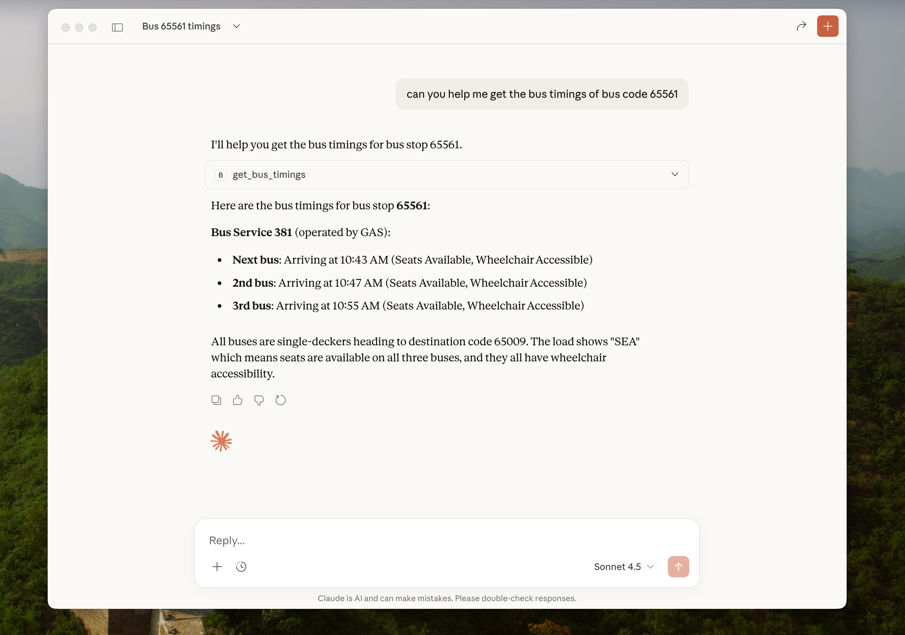

# mcp-sg-busstop-rust
MCP for getting Singapore Bus Timing

## If you are using Claude


```
{
  "mcpServers": {
    "mcp-sg-busstop-rust": {
      "command": "/{absolute_path_to_build}/mcp-sg-busstop-rust",
      "env": {
        "API_ACCOUNT_KEY": "",
        "API_URL": ""
      }
    }
  },
  "preferences": { }
}
```